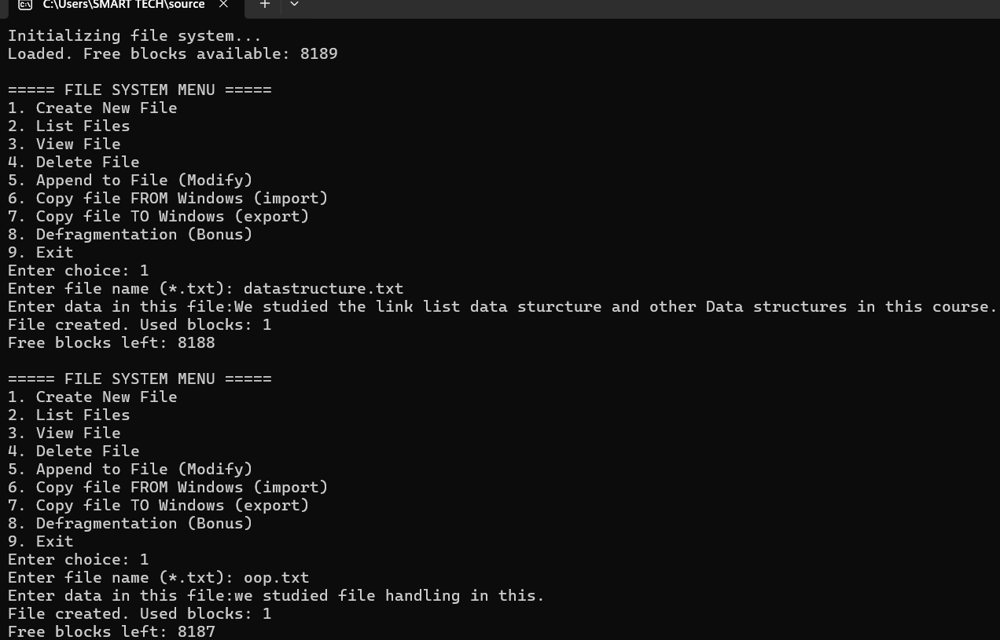
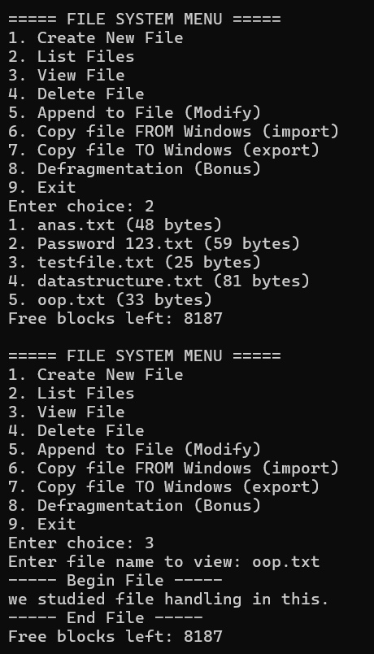
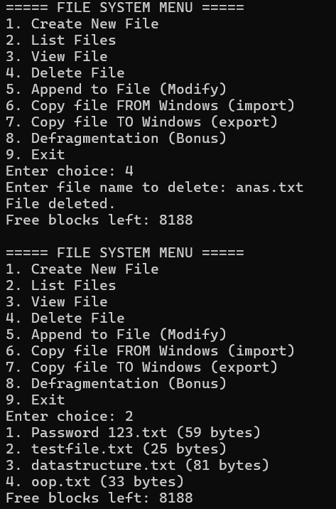
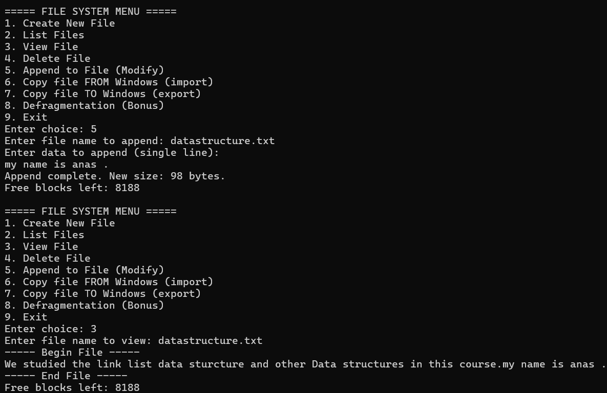
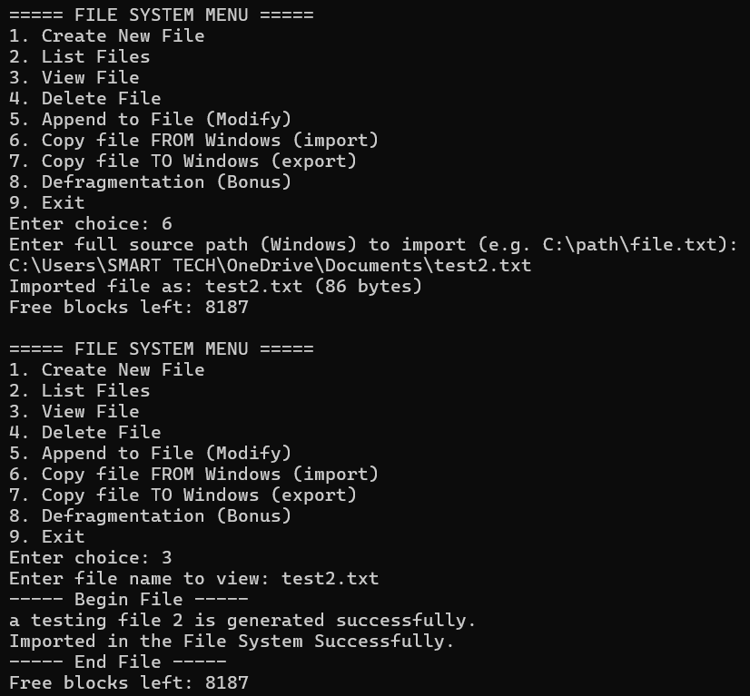
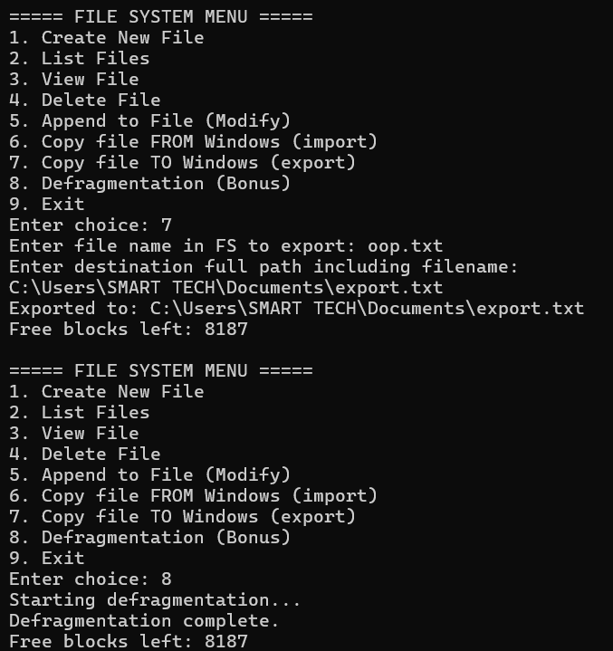
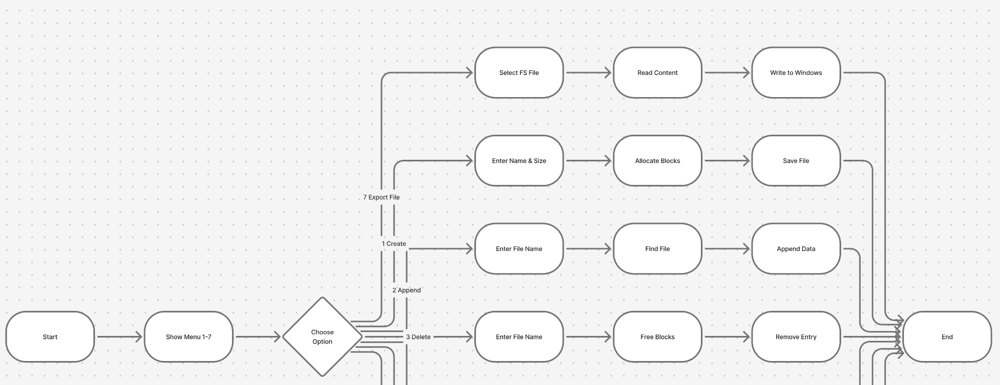
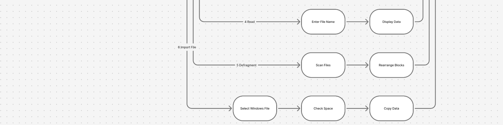
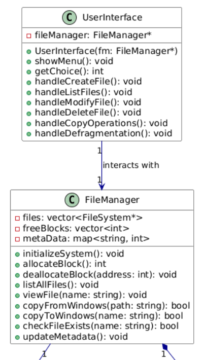
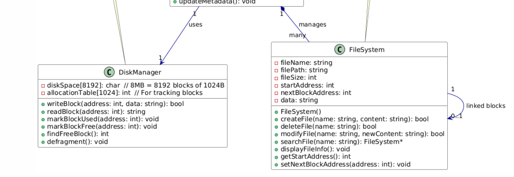

# 🗂️ File System Implementation in C++

A custom **File System** built from scratch in C++ using **Object-Oriented Programming** and **Data Structures**, developed as part of the Object-Oriented Data Structures Lab at **FAST-NUCES, Chiniot-Faisalabad Campus**.

---

## 📋 Project Overview

This project simulates a real operating system file system entirely in software. Instead of using Windows or Mac's built-in file system, we built our own — complete with block-based storage, directory management, free space tracking, and defragmentation.

The virtual disk is a **10MB binary file** split into three regions:

| Region | Size | Purpose |
|--------|------|---------|
| Directory Region | 1 MB | Stores file names and metadata |
| Free List Region | 1 MB | Tracks available blocks |
| Data Region | 8 MB | Stores actual file content |

---

## ✨ Features

- 📄 **Create** new text files with custom content
- 📋 **List** all files with their sizes
- 👁️ **View** file content
- 🗑️ **Delete** files and reclaim blocks
- ✏️ **Append** data to existing files
- 📥 **Import** files from Windows into the file system
- 📤 **Export** files from the file system to Windows
- 🔧 **Defragmentation** — reorganizes fragmented storage for efficiency

---

## 🏗️ Data Structures Used

- **Doubly Linked List** — for in-memory directory management
- **Singly Linked List** — for free block tracking
- **Dynamic Arrays** — for temporary defragmentation buffers
- **Block-chained storage** — each 1024-byte block stores a pointer to the next block

---

## 🧮 Disk Layout

```
10 MB Virtual Disk (File_system.dat)
├── Directory Region (1 MB)
│   └── 500-byte entries: [filename(256B) | startBlock(4B) | fileSize(4B)]
├── Free List Region (1 MB)
│   └── Tracks free/used blocks
└── Data Region (8 MB)
    └── 8192 blocks × 1024 bytes each
        └── [nextBlock(4B) | data(1020B)]
```

---

## 📸 Screenshots

### Program Menu & Create File


### List Files & View File


### Delete File


### Append to File


### Import File from Windows


### Export File & Defragmentation


### Flowchart



### UML Class Diagram



---

## 🚀 How to Run

1. Clone the repository:
```bash
git clone https://github.com/muhammad-anas-ee/File-System-Implementation.git
```

2. Compile the code:
```bash
g++ FileSystemImplementation.cpp -o FileSystem
```

3. Run the program:
```bash
./FileSystem
```

> **Note:** The program creates a `File_system.dat` file (10MB virtual disk) on first run. This is normal.

---

## 🛠️ Technologies Used

- **Language:** C++
- **Concepts:** OOP, Linked Lists, Dynamic Memory Allocation, File I/O, Block-based Storage
- **No STL containers used** — all data structures built from scratch

---

## 👨‍💻 Developed By

| Name | Student ID |
|------|-----------|
| Muhammad Anas | 24F-6125 |
| Muhammad Usman | 24F-6118 |

**Submitted to:** Engr. Amna Saghir — Lecturer, CE Department  
**Course:** CL2021 – Object-Oriented Data Structures Lab  
**University:** FAST-NUCES, Chiniot-Faisalabad Campus
